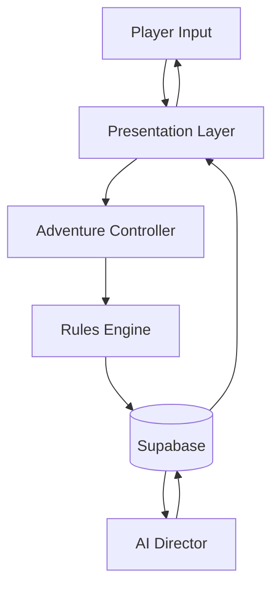
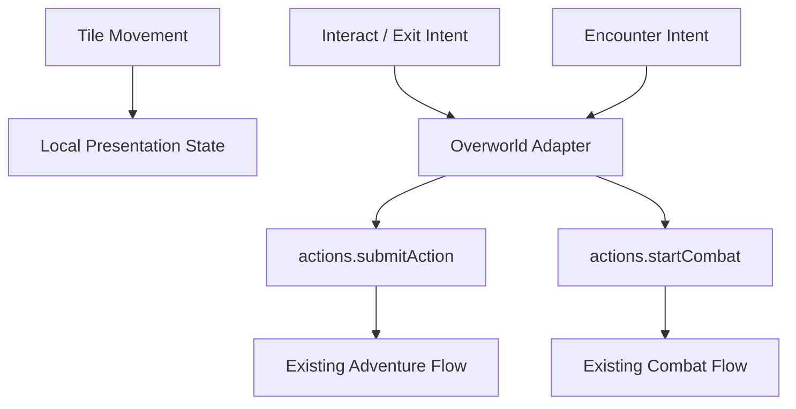

# ChronAI Architecture

ChronAI keeps storytelling, mechanical resolution, persistence, and presentation separate:

> The AI proposes. The rules engine resolves. The database remembers.

This is the living architecture summary for fresh AI sessions. The deeper handbook remains in `docs/architecture/`.

Implementation rationale and tradeoffs live in `docs/DECISIONS.md`. Keep this file focused on current responsibilities, boundaries, and data flow.

## System Responsibilities

### Adventure Controller

The Adventure Controller coordinates a player action across state loading, rules resolution, persistence, AI narration, and UI refresh. It orchestrates order of operations but does not resolve mechanics, generate prose, own storage, or render UI.

### Rules Engine

The Rules Engine is the deterministic authority for dice, modifiers, conditions, action validation, combat, HP, XP, loot outcomes, and derived character values. AI narration cannot override its outputs.

### AI Director

The AI Director turns authoritative state and resolved outcomes into narration, suggestions, memory updates, and story framing. It never rolls dice, changes HP, grants inventory, decides success, or fabricates persistent facts.

### Persistence

Supabase stores durable truth: profiles, characters, campaigns, sessions, turns, world state, Director config, Director documents, and auth-backed ownership. Presentation components must not write directly to Supabase; use service/controller flows.

### UI

React, Vite, Tailwind, pixel components, and Zustand presentation state render real data and collect player intent. UI may stage temporary presentation state, but authoritative game state belongs to the engine/controller/persistence path.

### Overworld (Unified Adventure Screen)

The playable overworld is the primary surface of the unified Adventure screen — a presentation and input layer composed of three integrated parts: the world (fixture maps, tile position, camera, transitions), the Story HUD (NPC dialogue and ambient narration beats docked over the world, watermarked by turn count so history never replays as fresh), and the contextual ActionStrip (faced-entity verbs, Rest, Menu). Character, Dice, Journal, Quests, Atlas, Codex, Settings, and flagged Debug panels open through the pause overlay over the frozen world; the bottom tab nav and Esc drive the same overlay. All of it is UI state; meaningful interactions become existing `AdventureActions` calls through the overworld adapter. Per-tile movement is not persisted; combat swaps the surface and returns with exact position/facing preserved in hub-owned presentation state.

### Combat

Combat uses the existing engine for initiative, attacks, damage, death saves, outcomes, XP, loot, and summary records. Combat UI presents and advances resolved combat state without creating a second combat rules system.

### Audio

Audio is manifest-driven with music, ambience, SFX, volume controls, mute, and silent fallback when assets are absent. Audio context is derived from real game state when available and must not invent weather, location, or combat facts.

### World Renderer

The World Renderer and pixel scenery systems create scene-first presentation across screens. They may visualize real state or neutral menu/title decoration, but in-game visuals must not imply untracked world facts.

## Data Flow

## Overworld Interaction Flow

## Architectural Boundaries

- Presentation reads state; services and controller flows mutate durable state.
- AI prose describes resolved facts; it does not create mechanics.
- The rules engine resolves mechanics; it does not narrate or persist.
- Supabase remembers state; components do not keep durable shadow copies.
- New features extend existing subsystem contracts before adding new ones.
- Temporary preview routes and verification pages are not architecture and must not be committed.

## Update Rule

Update this file whenever a phase changes subsystem responsibilities, data ownership, or data flow. Do not use it as a phase log; append historical details to `docs/CHANGELOG.md` instead.
