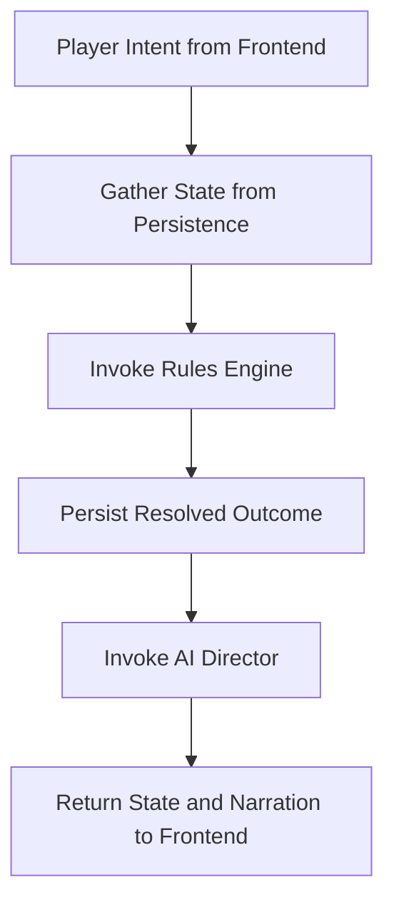

# Chronicle AI — Adventure Controller

## Purpose

This document defines the Adventure Controller: the orchestration layer for
Chronicle AI. It coordinates the request lifecycle between the Frontend,
Rules Engine, Persistence Layer, and AI Director, ensuring each subsystem is
invoked in the correct order and with authoritative state. It is
implementation-agnostic and should be read alongside
[architecture-principles.md](./architecture-principles.md),
[system-overview.md](./system-overview.md),
[world-model.md](./world-model.md), [rules-engine.md](./rules-engine.md),
[persistence.md](./persistence.md), and [ai-director.md](./ai-director.md).

The Adventure Controller is the "how" behind the ordering already established
elsewhere: mechanics resolve before narration, and every subsystem reads and
writes durable state through the Persistence Layer rather than its own copy
of the truth. The Controller is what enforces that ordering on every request.

## What It Coordinates

The Adventure Controller sits between four subsystems and governs how a
single player action moves through them:

- **Frontend** — the source of player intent and the destination for
  updated state and narration.
- **Rules Engine** — invoked when an action requires mechanical resolution.
- **Persistence Layer** — the source and destination of authoritative state.
- **AI Director** — invoked once state is authoritative, to narrate what
  happened.

## What the Adventure Controller Owns

- Request orchestration — deciding which subsystems are involved in handling
  a given player action.
- Execution order — ensuring subsystems run in the sequence the architecture
  requires.
- Passing authoritative state between subsystems, so each one operates on
  the same facts.
- Ensuring rules resolve before narration is generated.
- Handling failures between subsystems without leaving the campaign in an
  inconsistent state.

## What It Does NOT Own

The Adventure Controller never:

- Decides game mechanics — that belongs to the Rules Engine.
- Generates narrative prose — that belongs to the AI Director.
- Owns persistent storage — that belongs to the Persistence Layer.
- Renders UI — that belongs to the Frontend.
- Defines database schema — that is a Persistence Layer concern and outside
  the scope of any architecture document.

## Standard Action Lifecycle

1. Player intent enters from the Frontend.
2. The Controller gathers required state from the Persistence Layer.
3. The Controller invokes the Rules Engine when mechanics are needed.
4. The Controller persists resolved outcomes.
5. The Controller invokes the AI Director after state is authoritative.
6. The Controller returns updated state and narration to the Frontend.

At no point in this lifecycle does the Controller itself resolve mechanics,
write narration, or decide what the durable state should be — it only
determines when each authoritative subsystem is invoked and ensures each one
receives the state it needs.

## Architectural Invariants

- The Controller orchestrates but does not decide mechanics.
- It never lets AI narration override rules outcomes.
- It never treats frontend state as authoritative.
- It ensures state changes are persisted before narration is presented.
- It coordinates failure handling without corrupting campaign state.
