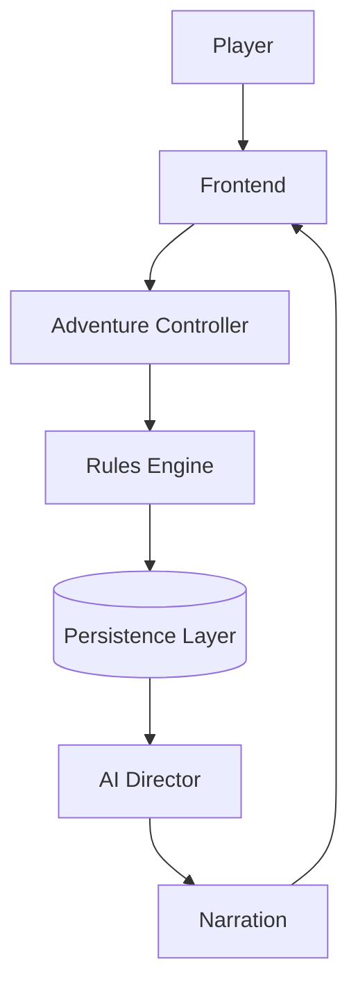

# Chronicle AI — AI Director

## Purpose

This document defines the architecture of the AI Director in Chronicle AI —
the subsystem responsible for storytelling. It is one of the primary
architecture documents for the project, alongside
[architecture-principles.md](./architecture-principles.md),
[system-overview.md](./system-overview.md),
[rules-engine.md](./rules-engine.md), and [persistence.md](./persistence.md),
and should be read as the definitive long-term specification for how the AI
Director operates within the overall system. It is implementation-agnostic.

## Overall Philosophy

The AI Director is responsible for storytelling, not game mechanics. It
transforms deterministic game outcomes into immersive narrative experiences
while preserving complete fidelity to the authoritative world state. It is
never allowed to invent or modify mechanical outcomes.

- The Rules Engine decides what happened.
- The Persistence Layer stores what happened.
- The AI Director explains what happened.

## Responsibilities

The AI Director is responsible for:

- Narration
- Dialogue
- Pacing
- Atmosphere
- Scene descriptions
- NPC personality expression
- Quest presentation
- Dramatic tension
- Environmental storytelling
- Player immersion

## The AI Director Owns

- Narrative generation
- Storytelling style
- Descriptive language
- Emotional tone
- NPC speech
- Narrative transitions
- Cinematic presentation

## The AI Director Does NOT Own

The AI Director never:

- Rolls dice.
- Resolves mechanics.
- Determines success or failure.
- Modifies HP.
- Changes inventory.
- Changes world state.
- Invents persistent facts.
- Overrides campaign history.
- Bypasses the Rules Engine.
- Bypasses the Persistence Layer.

## Inputs

The AI Director receives information such as:

- The resolved mechanical outcome.
- Current world state.
- Campaign history.
- Active quest state.
- NPC information.
- Location information.
- Player history.
- Player preferences.
- Previous narration.
- Current scene context.

## Outputs

The AI Director produces:

- Narration.
- Dialogue.
- Descriptions.
- Scene transitions.
- NPC conversations.
- Atmosphere.
- Flavor text.
- Optional quest suggestions.
- Optional dramatic hooks.

All outputs are narrative only. None of them are mechanical outcomes or
persisted facts in their own right.

## Narrative Boundaries

The AI Director may describe outcomes. It may never change outcomes.

By the time the AI Director generates narration, the Rules Engine has
already resolved what happened, and the Persistence Layer has already
recorded it. Narration is a presentation of that fixed outcome, not a second
opportunity to decide it.

**Acceptable:** The Rules Engine resolves that an attack hits for 8 damage.
The AI Director narrates: *"Your blade finds a gap in the guard's armor,
biting deep — he staggers back, blood welling at his side."*

**Unacceptable:** The Rules Engine resolves that an attack misses. The AI
Director narrates the attack as landing, or invents a wound, a death, or an
item the resolved outcome did not produce.

**Acceptable:** The AI Director invents a passing atmospheric detail — the
smell of rain, a distant bell — that does not affect quest state, inventory,
or any tracked fact.

**Unacceptable:** The AI Director narrates that an NPC gives the player a
reward, joins their party, or reveals information as settled fact, when no
mechanical resolution or persisted record established that this happened.

## Memory

The AI Director relies on persistent memory rather than attempting to
remember the campaign independently. Its narrative continuity comes from
what has actually been recorded, including:

- Journals.
- Codex entries.
- NPC memories.
- Campaign history.
- Previous conversations.

The AI Director consumes memory. The Persistence Layer owns memory.

## Narrative Styles

Chronicle AI should eventually support multiple storytelling styles,
including:

- Matt Mercer.
- Brennan Lee Mulligan.
- Tolkien-inspired.
- Grimdark.
- Horror.
- Whimsical.
- Sandbox.
- Narrative-first.

These styles influence presentation only. They never influence mechanics.

## AI Provider Independence

The AI Director should remain independent of any specific LLM. Future
providers may include:

- OpenAI.
- Anthropic.
- Google.
- Local models.

Changing providers should not require architectural redesign. The AI
Director's responsibilities, inputs, outputs, and boundaries are the same
regardless of which provider generates the narration.

## Failure Handling

Gameplay must continue if AI generation fails. Mechanical resolution and
persistence are not dependent on narration succeeding, so a failure to
generate narration cannot invalidate a campaign, block progression, or alter
resolved state. The campaign remains valid, mechanics remain authoritative,
and narration can be regenerated later without changing anything that
already happened.

## Mermaid Diagram

## Architectural Invariants

- AI never determines mechanics.
- AI never changes persistent state.
- AI narrates only authoritative outcomes.
- AI always operates after mechanical resolution.
- AI can be regenerated without changing gameplay.
- AI providers are replaceable.
- Narrative style never changes mechanics.
