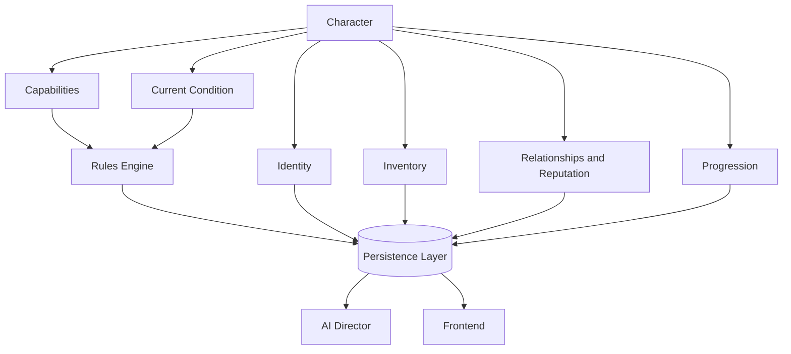

# Chronicle AI — Character

## Purpose

This document elaborates on the Character concept introduced in
[world-model.md](./world-model.md): the player's persona within the World —
their identity, capabilities, possessions, and standing, as it evolves over
the course of a Campaign. It is implementation-agnostic and should be read
alongside [architecture-principles.md](./architecture-principles.md),
[system-overview.md](./system-overview.md),
[rules-engine.md](./rules-engine.md), [persistence.md](./persistence.md),
[ai-director.md](./ai-director.md), and
[adventure-controller.md](./adventure-controller.md).

A Character is a concept the whole architecture shares, not a subsystem in
its own right. This document exists to say, precisely, what a Character is
made of and which subsystem is authoritative for each part of it.

## What a Character Represents

A Character is composed of:

- **Identity** — name, background, and concept.
- **Capabilities** — what the Character can attempt and how effectively,
  under whatever ruleset is active.
- **Possessions** — the Character's Inventory of Items.
- **Standing** — the Character's Relationships and Reputation with NPCs,
  Factions, and Regions.
- **Progression** — how the Character's capabilities and standing change
  over the course of the Campaign.
- **Current condition** — the Character's state within the present Turn or
  Encounter, such as active conditions or temporary modifiers.

A Character does not exist independently of a World — it is meaningful only
as part of the Campaign it belongs to, and its history is part of that
Campaign's Timeline.

## Authoritative Ownership

A Character is a concept referenced by every subsystem, but it is not itself
an authority over any of the facts it represents:

- The **Rules Engine** is the sole authority for whether a change to a
  Character's capabilities, condition, or possessions is mechanically valid,
  and for computing what that change is.
- The **Persistence Layer** is the sole authority for what a Character's
  state currently is and has been — its identity, progression, Inventory,
  Relationships, and Reputation are only real once persisted.
- The **AI Director** narrates a Character's actions and standing, but a
  Character's mechanical facts are never established by narration.
- The **Frontend** presents a Character's state to the player, but holds no
  authoritative copy of it.
- The **Adventure Controller** ensures that any change to a Character's state
  passes through the Rules Engine before it is persisted, and is persisted
  before it is narrated.

A Character, in other words, is a shared reference point — not a source of
truth in itself. Its truth lives in the Persistence Layer; its changes are
decided by the Rules Engine; its story is told by the AI Director.

## Relationship to Other Concepts

A Character occupies a Location, pursues Quests, engages in Encounters,
holds an Inventory of Items, and carries Relationships and Reputation with
NPCs and Factions. Everything that happens to a Character is recorded on the
Campaign's Timeline, and made available to the player through the Journal
and Codex. See [world-model.md](./world-model.md) for how these concepts fit
together.

## Character Lifecycle

A Character is created before a Campaign begins.

Throughout a Campaign, the Character evolves through resolved actions.

Each resolved action may modify the Character's authoritative state through
the Rules Engine and Persistence Layer.

Across Sessions, the Character retains its identity, progression, inventory,
relationships, and reputation.

A Character ceases to participate in a Campaign only through a mechanically
resolved outcome or an explicit campaign-level decision recorded in
persistent state.

## Architectural Invariants

- A Character's mechanical state can only change through the Rules Engine.
- A Character's authoritative state exists only in the Persistence Layer.
- Narration may describe a Character's actions and standing but cannot alter
  their capabilities, possessions, or condition.
- A Character's state as shown in the Frontend always reflects persisted
  state, not locally computed state.
- A Character's identity and progression persist across Sessions and Turns
  and are never reconstructed from narration.

## Mermaid Diagram

