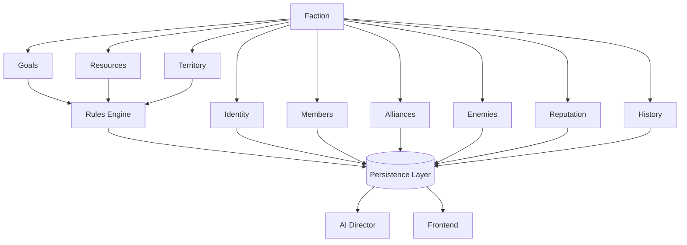

# Chronicle AI — Faction

## Purpose

This document elaborates on the Faction concept introduced in
[world-model.md](./world-model.md): an organized group within the World with
its own goals, alliances, and disposition toward the Character and other
Factions. It is implementation-agnostic and should be read alongside
[architecture-principles.md](./architecture-principles.md),
[character.md](./character.md), [npc.md](./npc.md),
[relationship.md](./relationship.md), [reputation.md](./reputation.md),
[persistence.md](./persistence.md), [rules-engine.md](./rules-engine.md),
[ai-director.md](./ai-director.md),
[adventure-controller.md](./adventure-controller.md), and
[frontend.md](./frontend.md).

## What a Faction Represents

A Faction represents an organized group within the World — a guild, a
kingdom, a cult, a company of mercenaries, or any other collective that acts
with a shared identity and purpose. A Faction exists to give the World
organizations that persist and pursue their own agenda independently of any
single Character or NPC, and independently of any one scene.

A Faction may have:

- **Identity** — name, culture, and concept.
- **Goals** — what the Faction is working toward.
- **Members** — the Characters and NPCs who belong to it.
- **Alliances** — other Factions it cooperates with.
- **Enemies** — other Factions or entities it opposes.
- **Territory** — the Locations and Regions it holds influence over.
- **Reputation** — how the Faction is regarded by the World at large.
- **Resources** — what the Faction commands or controls.
- **History** — what the Faction has done over the course of the Campaign.

## Authoritative Ownership

A Faction is a concept referenced by every subsystem, but it is not itself
an authority over any of the facts it represents:

- The **Rules Engine** validates and resolves mechanical changes to a
  Faction — shifts in its resources, territory, alliances, or standing that
  result from resolved actions.
- The **Persistence Layer** is the sole authority for what a Faction's state
  currently is and has been — its identity, goals, members, alliances,
  enemies, territory, reputation, resources, and history are only real once
  persisted.
- The **AI Director** describes a Faction's behavior and voice — how its
  members act, speak, and react — but cannot create or modify a Faction's
  authoritative state on its own authority.
- The **Frontend** presents Faction information to the player, but holds no
  authoritative copy of it.
- The **Adventure Controller** orchestrates updates to a Faction, ensuring
  any change passes through the Rules Engine before it is persisted, and is
  persisted before it is narrated.

A Faction, in other words, is a shared reference point — not a source of
truth in itself. Its truth lives in the Persistence Layer; its changes are
decided by the Rules Engine; its voice is expressed by the AI Director.

## Relationship to Other Concepts

A Faction is composed of Characters and NPCs as members, holds territory
across Locations and Regions, and carries Relationships and Reputation with
Characters, NPCs, and other Factions. Factions pursue their goals through
Quests and Encounters, and everything a Faction does is recorded on the
Campaign's Timeline and made available to the player through the Journal and
Codex. See [world-model.md](./world-model.md) for how these concepts fit
together, and [character.md](./character.md) and [npc.md](./npc.md) for the
entities that may belong to a Faction.

## Faction Lifecycle

A Faction is introduced into a Campaign when the World first requires it —
either as part of the Campaign's initial state or as the story unfolds.

Throughout a Campaign, a Faction evolves through resolved actions: its
goals, membership, alliances, enemies, territory, reputation, and resources
may all change as a consequence of mechanically resolved outcomes.

A Faction may continue to change independently of the Character, provided
those changes become part of authoritative world state.

Across Sessions, a Faction retains its identity, goals, membership,
alliances, enemies, territory, reputation, resources, and history.

A Faction ceases to exist or ceases to act within a Campaign only through a
mechanically resolved outcome or an explicit campaign-level decision
recorded in persistent state.

## Architectural Invariants

- A Faction's mechanical state can only change through the Rules Engine.
- A Faction's authoritative state exists only in the Persistence Layer.
- The AI Director may express a Faction's behavior and voice but cannot
  create authoritative Faction facts without persistence.
- Faction changes become part of campaign history.
- Factions survive across Sessions.
- Every subsystem uses the same authoritative Faction.

## Mermaid Diagram

