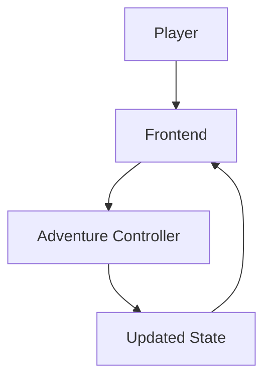

# Chronicle AI — Frontend

## Purpose

This document defines the architecture of the Frontend in Chronicle AI. The
Frontend is responsible for presenting authoritative game state to the
player and collecting player intent. It is implementation-agnostic and
should be read alongside [architecture-principles.md](./architecture-principles.md),
[system-overview.md](./system-overview.md),
[adventure-controller.md](./adventure-controller.md),
[rules-engine.md](./rules-engine.md), [persistence.md](./persistence.md),
[ai-director.md](./ai-director.md), and [world-model.md](./world-model.md).

## Responsibilities

The Frontend is responsible for:

- Rendering campaign state.
- Rendering narration.
- Displaying combat.
- Presenting character information.
- Presenting maps.
- Collecting player decisions.
- Accessibility.
- Responsiveness.

## What the Frontend Owns

The Frontend owns presentation and interaction only: how authoritative state
and narration are shown to the player, and how the player's decisions are
captured and submitted. It owns nothing about what that state means or how
it came to be.

## What the Frontend Does NOT Own

The Frontend never:

- Resolves mechanics.
- Generates narration.
- Stores authoritative state.
- Determines game outcomes.
- Bypasses the Adventure Controller.

Every one of these responsibilities belongs to another subsystem — the Rules
Engine, the AI Director, or the Persistence Layer — and reaches the Frontend
only after passing through the Adventure Controller.

## Interaction Model

All player intent flows through the Adventure Controller. The Frontend does
not submit actions directly to the Rules Engine, the Persistence Layer, or
the AI Director, and it does not read authoritative state from them
directly. The Adventure Controller is the sole path between what the player
does and what the rest of the architecture does about it.

## Architectural Invariants

- Frontend state is never authoritative.
- The Frontend reflects persisted state.
- All gameplay decisions originate from player intent.
- Mechanics are never computed in the Frontend.
- Narration is displayed, not created.

## Mermaid Diagram

