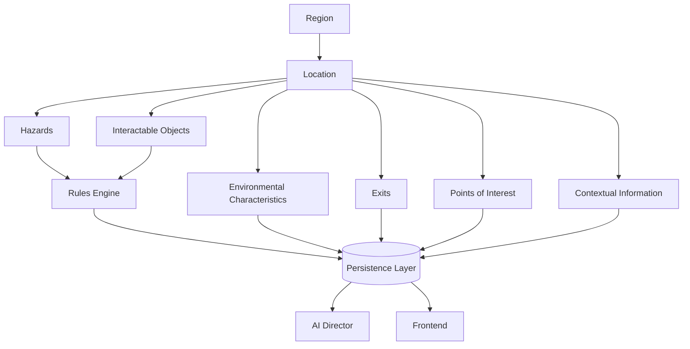

# Chronicle AI — Location

## Purpose

This document elaborates on the Location concept introduced in
[world-model.md](./world-model.md): a specific place within the World where
scenes occur — a room, a building, a clearing, a dungeon. It is
implementation-agnostic and should be read alongside
[architecture-principles.md](./architecture-principles.md),
[region.md](./region.md), [character.md](./character.md),
[npc.md](./npc.md), [faction.md](./faction.md),
[rules-engine.md](./rules-engine.md), [persistence.md](./persistence.md),
[ai-director.md](./ai-director.md),
[adventure-controller.md](./adventure-controller.md), and
[frontend.md](./frontend.md).

## What a Location Represents

A Location is the smallest meaningful place where gameplay occurs — the
level of granularity at which a Character actually stands, looks around, and
acts. Where a Region gives the World geographic and cultural context above
the level of a single place, a Location is that place itself.

Locations exist within Regions. A Region provides the surrounding context —
culture, politics, environment — that a Location inherits and expresses at a
specific, immediate scale.

Characters, NPCs, Items, Encounters, and Quests occur within Locations. A
Location is where the Character meets an NPC, finds or loses an Item,
enters an Encounter, or advances a Quest.

A Location may contain:

- **Environmental characteristics** — terrain, lighting, weather, and other
  sensory conditions.
- **Interactable objects** — things within the Location the Character can
  examine or act upon.
- **Exits** — connections to other Locations.
- **Hazards** — dangers present within the Location.
- **Points of interest** — notable features worth the Character's attention.
- **Contextual information** — details that inform what is possible or
  plausible at that place.

A Location provides context. It does not resolve mechanics — it does not
itself determine whether an action succeeds, what damage a hazard deals, or
any other rule-governed result. It shapes what is present and possible; the
Rules Engine decides what actually happens.

## Authoritative Ownership

A Location is a concept referenced by every subsystem, but it is not itself
an authority over any of the facts it represents:

- The **Rules Engine** validates and resolves mechanical interactions
  involving a Location — such as hazards triggering, objects being used, or
  movement between exits.
- The **Persistence Layer** is the sole authority for what a Location's
  state currently is and has been — its environmental characteristics,
  objects, exits, hazards, points of interest, and contextual information
  are only real once persisted.
- The **AI Director** describes a Location — its atmosphere, sensory detail,
  and mood — but cannot create or modify a Location's authoritative state on
  its own authority.
- The **Frontend** presents a Location to the player, but holds no
  authoritative copy of it.
- The **Adventure Controller** orchestrates updates to a Location, ensuring
  any change passes through the Rules Engine before it is persisted, and is
  persisted before it is narrated.

A Location, in other words, is a shared reference point — not a source of
truth in itself. Its truth lives in the Persistence Layer; its mechanical
changes are decided by the Rules Engine; its atmosphere is expressed by the
AI Director.

## Relationship to Other Concepts

A Location exists within a Region and inherits the context that Region
provides. Characters and NPCs occupy a Location, Items may be found or left
within it, and Encounters and Quests unfold within its bounds. Everything
that changes about a Location is recorded on the Campaign's Timeline and made
available to the player through the Journal and Codex. See
[world-model.md](./world-model.md) for how these concepts fit together, and
[region.md](./region.md) for how Locations are grouped into broader
geographic and cultural context.

## Location Lifecycle

A Location is introduced into a Campaign when the World first requires it —
either as part of the Campaign's initial state or as the story unfolds and
the Character travels somewhere new.

Throughout a Campaign, a Location evolves through resolved actions: its
objects, hazards, points of interest, and environmental characteristics may
all change as a consequence of mechanically resolved outcomes.

A Location may continue to change independently of the Character, provided
those changes become part of authoritative world state.

Across Sessions, a Location retains its environmental characteristics,
objects, exits, hazards, points of interest, and contextual information.

A Location ceases to be relevant to a Campaign only through a mechanically
resolved outcome or an explicit campaign-level decision recorded in
persistent state.

## Architectural Invariants

- A Location's mechanical state can only change through the Rules Engine.
- A Location's authoritative state exists only in the Persistence Layer.
- The AI Director may describe a Location but cannot create authoritative
  Location facts without persistence.
- Location changes become part of campaign history.
- Locations survive across Sessions.
- Every subsystem uses the same authoritative Location.

## Mermaid Diagram

