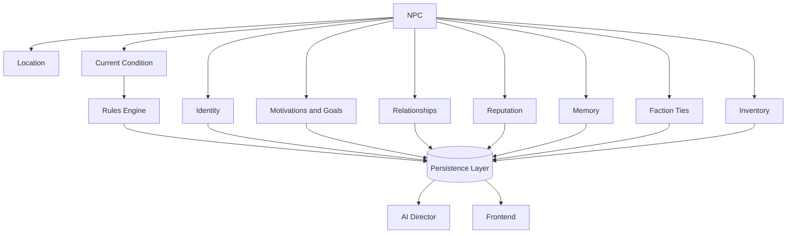

# Chronicle AI — NPC

## Purpose

This document elaborates on the NPC concept introduced in
[world-model.md](./world-model.md): an inhabitant of the World with their own
identity, motivations, and continuity, who the Character can interact with.
It is implementation-agnostic and should be read alongside
[architecture-principles.md](./architecture-principles.md),
[system-overview.md](./system-overview.md), [character.md](./character.md),
[rules-engine.md](./rules-engine.md), [persistence.md](./persistence.md),
[ai-director.md](./ai-director.md), and
[adventure-controller.md](./adventure-controller.md).

An NPC is a concept the whole architecture shares, not a subsystem in its own
right. This document exists to say, precisely, what an NPC is made of and
which subsystem is authoritative for each part of it.

## Responsibilities / Conceptual Role

An NPC represents an inhabitant of the World other than the Character —
someone (or something) the Character can meet, speak with, fight, ally with,
or be affected by. An NPC exists to give the World people to interact with
who have their own continuity, independent of any single scene.

An NPC may have:

- **Identity** — name, background, and concept.
- **Motivations and goals** — what the NPC wants and is working toward.
- **Relationships** — connections to the Character, other NPCs, and
  Factions.
- **Reputation** — how the NPC is regarded, and how the NPC regards others.
- **Memory** — a persisted record of what the NPC has witnessed or been told.
- **Faction ties** — membership in or allegiance to one or more Factions.
- **Location** — where the NPC currently is in the World.
- **Inventory** — Items the NPC currently holds.
- **Current condition** — the NPC's state within the present Turn or
  Encounter, such as active conditions or temporary modifiers.

## Authoritative Ownership

An NPC is a concept referenced by every subsystem, but it is not itself an
authority over any of the facts it represents:

- The **Rules Engine** is the sole authority for whether a change to an
  NPC's condition, capabilities, or possessions is mechanically valid, and
  for computing what that change is.
- The **Persistence Layer** is the sole authority for what an NPC's state
  currently is and has been — identity, motivations, relationships,
  reputation, memory, faction ties, location, and inventory are only real
  once persisted.
- The **AI Director** may express an NPC — their voice, manner, and
  reactions — but cannot create authoritative NPC facts without persistence.
  An NPC's continuity comes from persisted state, not from the AI Director's
  own memory.
- The **Frontend** presents an NPC's dialogue and state to the player, but
  holds no authoritative copy of it.
- The **Adventure Controller** ensures that any change to an NPC's state
  passes through the Rules Engine before it is persisted, and is persisted
  before it is narrated.

An NPC, in other words, is a shared reference point — not a source of truth
in itself. Its truth lives in the Persistence Layer; its mechanical changes
are decided by the Rules Engine; its voice is expressed by the AI Director.

## Relationship to Other Concepts

An NPC occupies a Location, may belong to one or more Factions, and carries
Relationships and Reputation with the Character and other NPCs. NPCs
participate in Quests and Encounters, and hold an Inventory of Items.
Everything an NPC does or witnesses is recorded on the Campaign's Timeline,
and made available to the player through the Journal and Codex. See
[world-model.md](./world-model.md) for how these concepts fit together, and
[character.md](./character.md) for how the Character concept is
architecturally analogous.

## NPC Lifecycle

An NPC is introduced into a Campaign when the World first requires them —
either as part of the Campaign's initial state or as the story unfolds.

Throughout a Campaign, an NPC evolves through resolved actions, just as a
Character does: their relationships, reputation, memory, and condition may
all change as a consequence of mechanically resolved outcomes.

An NPC may continue to change independently of the Character, provided those
changes become part of authoritative world state.

Across Sessions, an NPC retains its identity, relationships, reputation,
memory, faction ties, and location.

An NPC ceases to participate in a Campaign only through a mechanically
resolved outcome or an explicit campaign-level decision recorded in
persistent state.

## Architectural Invariants

- An NPC's mechanical state can only change through the Rules Engine.
- An NPC's authoritative state exists only in the Persistence Layer.
- The AI Director may express an NPC but cannot create authoritative NPC
  facts without persistence.
- NPC continuity comes from persisted state, not from AI memory.
- An NPC's state as shown in the Frontend always reflects persisted state,
  not locally computed or generated state.

## Mermaid Diagram

