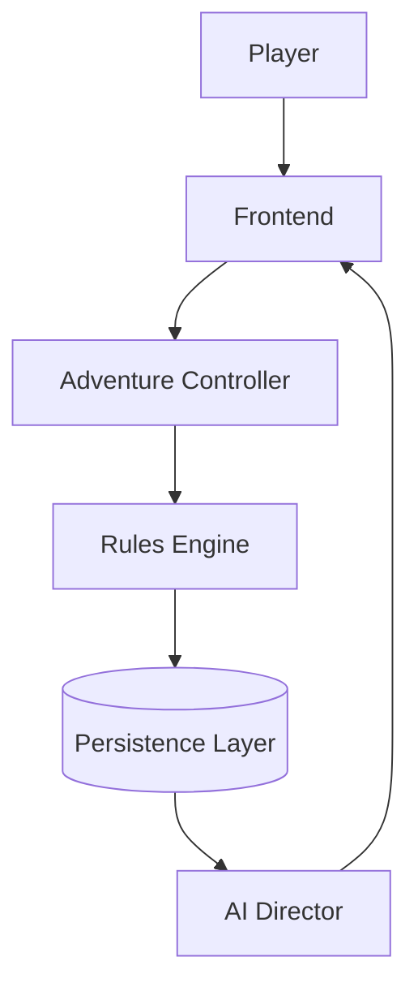

# Chronicle AI — Persistence Layer

## Purpose

The Persistence Layer is the system responsible for storing and retrieving
all durable game state in Chronicle AI. It is the "remembers" step in the
platform's core principle, defined in
[architecture-principles.md](./architecture-principles.md) and
[system-overview.md](./system-overview.md):

> The database remembers.

If a fact matters to gameplay and must survive beyond a single request, it is
recorded here — once, in one place — and treated as fact from then on.

## Responsibilities

The Persistence Layer stores the durable record of a campaign, including:

- Campaigns
- Characters
- NPCs
- World state
- Locations
- Inventories
- Quests
- Factions
- Encounters
- Turn history
- Journals
- Codex entries
- Relationships
- Reputation
- Player progression

## What the Persistence Layer Owns

- Durable storage of all campaign-related state.
- Versioned world state, so that state changes over time are trustworthy and
  traceable.
- Campaign history — a complete record of what has happened.
- Retrieval of saved data for other subsystems.
- Consistency of stored information, so that every subsystem reading from
  persistence sees the same durable truth.

## What It Does NOT Own

The Persistence Layer does not:

- Determine gameplay mechanics — that belongs to the Rules Engine.
- Generate narration — that belongs to the AI Director.
- Orchestrate requests — that belongs to the Adventure Controller.
- Render UI — that belongs to the Frontend.
- Validate game rules — that belongs to the Rules Engine.

## Source of Truth

Every subsystem reads from and writes through the Persistence Layer. No
subsystem — Frontend, Adventure Controller, Rules Engine, or AI Director —
maintains its own independent version of durable state. If two subsystems
disagree about the current state of a campaign, the Persistence Layer is
correct and the other subsystem is not.

## Request Flow

## Architectural Invariants

- Persistent state is authoritative.
- All durable state transitions originate from an authoritative subsystem
  before being persisted.
- Durable data is never inferred from narration.
- Every resolved action becomes campaign history.
- State changes occur before narration.
- Reloading a campaign reconstructs the world entirely from persisted state.

## Future Growth

The Persistence Layer is expected to support future capabilities as
architectural goals, without changing its core responsibility or its
boundaries with other subsystems:

- Multiplayer.
- Cloud synchronization.
- Offline synchronization.
- Branching timelines.
- Save snapshots.
- Rollback.
- Analytics.
- Replay.

Each of these extends what durable state the Persistence Layer manages and
how it is synchronized — none of them shift mechanical, narrative, or
orchestration responsibility onto the Persistence Layer.
