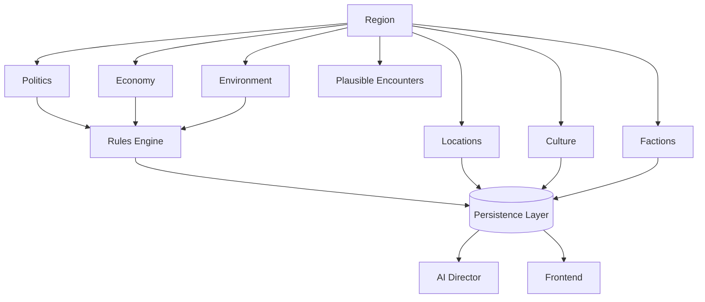

# Chronicle AI — Region

## Purpose

This document elaborates on the Region concept introduced in
[world-model.md](./world-model.md): a broader area that groups related
Locations, giving the World geographic and cultural structure above the
level of a single place. It is implementation-agnostic and should be read
alongside [architecture-principles.md](./architecture-principles.md),
[faction.md](./faction.md), [character.md](./character.md),
[npc.md](./npc.md), [relationship.md](./relationship.md),
[reputation.md](./reputation.md), [rules-engine.md](./rules-engine.md),
[persistence.md](./persistence.md), [ai-director.md](./ai-director.md),
[adventure-controller.md](./adventure-controller.md), and
[frontend.md](./frontend.md).

## What a Region Represents

A Region is a broader area of the World that organizes related Locations
into a coherent whole — a kingdom, a wilderness, a coastline, a city and its
surrounding countryside. Where a Location is a specific place a scene occurs
in, a Region is the geographic and cultural context that place belongs to.

A Region gives the World shape above the level of a single Location by
influencing:

- **Travel** — the distance, routes, and conditions between the Locations it
  contains.
- **Culture** — the customs, beliefs, and norms shared across its Locations.
- **Politics** — who holds power and influence across the area.
- **Environment** — climate, terrain, and natural conditions.
- **Economy** — trade, resources, and prosperity.
- **Factions** — which Factions hold territory or influence within it.
- **Encounters** — the kinds of situations that are plausible within it.

A Region provides geographic context. It is not responsible for mechanics —
it does not itself resolve travel time, encounter outcomes, or any other
rule-governed result. It shapes what is plausible and available; the Rules
Engine decides what actually happens.

## Authoritative Ownership

A Region is a concept referenced by every subsystem, but it is not itself an
authority over any of the facts it represents:

- The **Rules Engine** validates and resolves mechanical changes involving a
  Region — such as outcomes affected by its environment, travel conditions,
  or the Factions holding influence within it.
- The **Persistence Layer** is the sole authority for what a Region's state
  currently is and has been — its Locations, culture, politics, environment,
  economy, and the Factions present within it are only real once persisted.
- The **AI Director** describes a Region — its atmosphere, culture, and
  character — but cannot create or modify a Region's authoritative state on
  its own authority.
- The **Frontend** presents a Region to the player, but holds no
  authoritative copy of it.
- The **Adventure Controller** orchestrates updates to a Region, ensuring
  any change passes through the Rules Engine before it is persisted, and is
  persisted before it is narrated.

A Region, in other words, is a shared reference point — not a source of
truth in itself. Its truth lives in the Persistence Layer; its mechanical
changes are decided by the Rules Engine; its atmosphere is expressed by the
AI Director.

## Relationship to Other Concepts

A Region groups related Locations and provides the context in which
Characters and NPCs travel, Factions hold territory and influence, and
Encounters become plausible or implausible. Reputation with a Region reflects
how the Character or an NPC is regarded across it as a whole, distinct from
any single Relationship. Everything that changes about a Region is recorded
on the Campaign's Timeline and made available to the player through the
Journal and Codex. See [world-model.md](./world-model.md) for how these
concepts fit together, and [faction.md](./faction.md) for how Factions hold
territory within a Region.

## Region Evolution

A Region changes only through authoritative world events — actions resolved
by the Rules Engine and recorded by the Persistence Layer. Its politics,
Faction control, economy, and culture may shift over the course of a
Campaign as a consequence of resolved outcomes, but a Region does not change
itself, and narration cannot independently create or adjust what is true of
it. Across Sessions, a Region retains its Locations, culture, politics,
environment, economy, and Faction ties, evolving only as the Campaign's
history dictates.

## Architectural Invariants

- A Region's mechanical state can only change through the Rules Engine.
- A Region's authoritative state exists only in the Persistence Layer.
- The AI Director may describe a Region but cannot create authoritative
  Region facts without persistence.
- Region changes become part of campaign history.
- Regions survive across Sessions.
- Every subsystem uses the same authoritative Region.

## Mermaid Diagram

