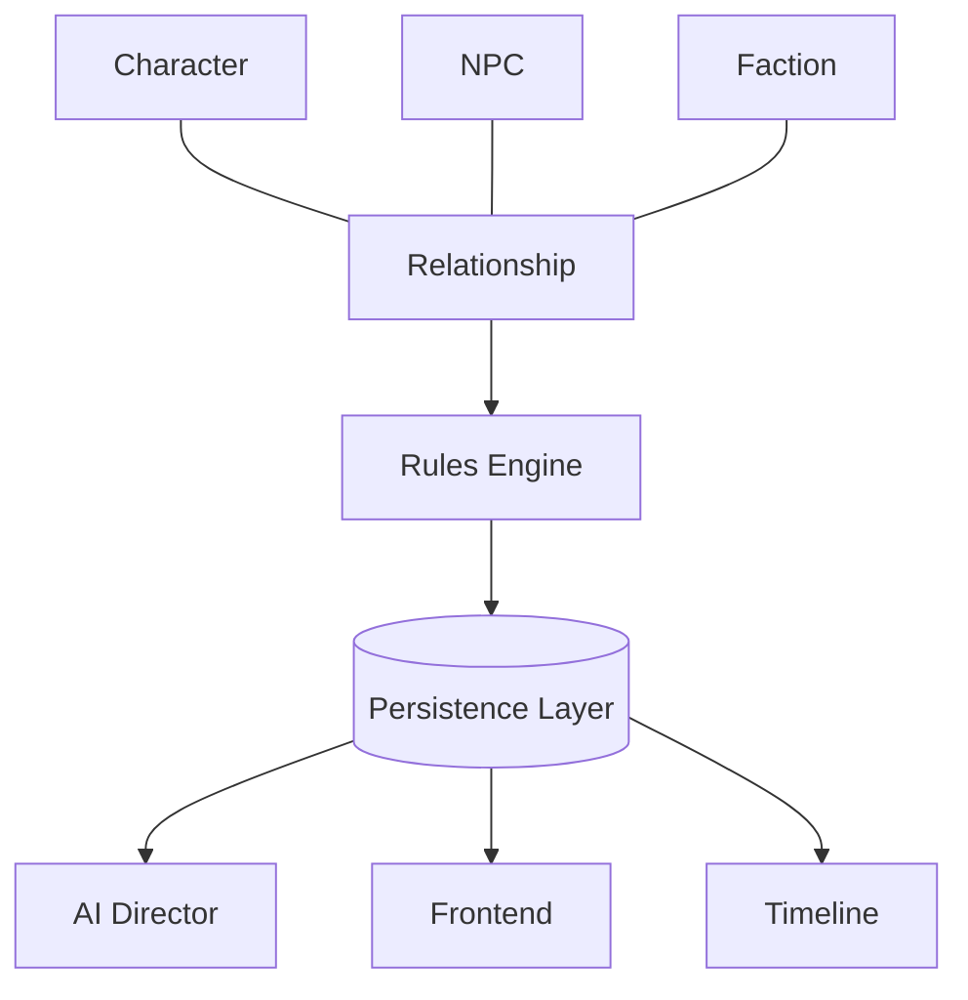

# Chronicle AI — Relationship

## Purpose

This document elaborates on the Relationship concept introduced in
[world-model.md](./world-model.md): the state of connection between the
Character (or an NPC) and another NPC or Faction. It is implementation-
agnostic and should be read alongside
[architecture-principles.md](./architecture-principles.md),
[character.md](./character.md), [npc.md](./npc.md),
[persistence.md](./persistence.md), [ai-director.md](./ai-director.md), and
[adventure-controller.md](./adventure-controller.md).

## Responsibilities / Conceptual Role

A Relationship represents the evolving connection between two entities
within the World. It is a persistent world concept, not a temporary
narrative device — a Relationship established in one scene is expected to
still be true, and to keep evolving, long after that scene has ended.

A Relationship may exist between:

- Character ↔ NPC
- NPC ↔ NPC
- Character ↔ Faction
- NPC ↔ Faction
- Faction ↔ Faction

A Relationship may carry any number of aspects, including:

- Trust
- Loyalty
- Friendship
- Rivalry
- Fear
- Respect
- Family
- Mentorship
- Romance
- Obligation
- Hostility
- Alliance

This document does not define what these aspects mean mechanically or how
they are measured — the exact interpretation of a Relationship depends on
the active ruleset and the Campaign it belongs to. What matters
architecturally is that a Relationship is a durable fact about the World,
capable of carrying one or more of these qualities at once and changing
over time.

## Authoritative Ownership

A Relationship is a concept referenced by every subsystem, but it is not
itself an authority over any of the facts it represents:

- The **Rules Engine** is the sole authority for whether a change to a
  Relationship is mechanically valid, and for computing what that change is.
- The **Persistence Layer** is the sole authority for what a Relationship
  currently is and has been — a Relationship is only real once persisted.
- The **AI Director** expresses a Relationship narratively — through
  dialogue, tone, and behavior — but cannot create or modify a Relationship
  on its own authority.
- The **Frontend** presents a Relationship's state to the player, but holds
  no authoritative copy of it.
- The **Adventure Controller** ensures that any change to a Relationship
  passes through the Rules Engine before it is persisted, and is persisted
  before it is narrated.

A Relationship, in other words, is a shared reference point — not a source
of truth in itself. Its truth lives in the Persistence Layer; its changes
are decided by the Rules Engine; its expression belongs to the AI Director.

## Relationship Evolution

Relationships evolve only through authoritative world events — actions
resolved by the Rules Engine and recorded by the Persistence Layer.
Narration may describe a change in how two entities regard one another, but
it cannot create that change independently: a shift in trust, loyalty, or
hostility becomes real only once it is resolved and persisted, not merely
because it was narrated.

## Relationship to Other Concepts

A Relationship connects a Character or NPC to another NPC or Faction, and is
closely tied to Reputation, which reflects how an entity is regarded more
broadly rather than by a single connection. Relationships often develop
through Quests and Encounters, and every change to a Relationship is
recorded on the Campaign's Timeline and made available to the player through
the Journal and Codex. See [world-model.md](./world-model.md) for how these
concepts fit together, and [character.md](./character.md) and
[npc.md](./npc.md) for the entities a Relationship connects.

## Architectural Invariants

- Relationships are persistent world state.
- AI narration cannot independently create or modify Relationships.
- Relationship changes become part of campaign history.
- Relationships survive across Sessions.
- Every subsystem uses the same authoritative Relationship.

## Mermaid Diagram

