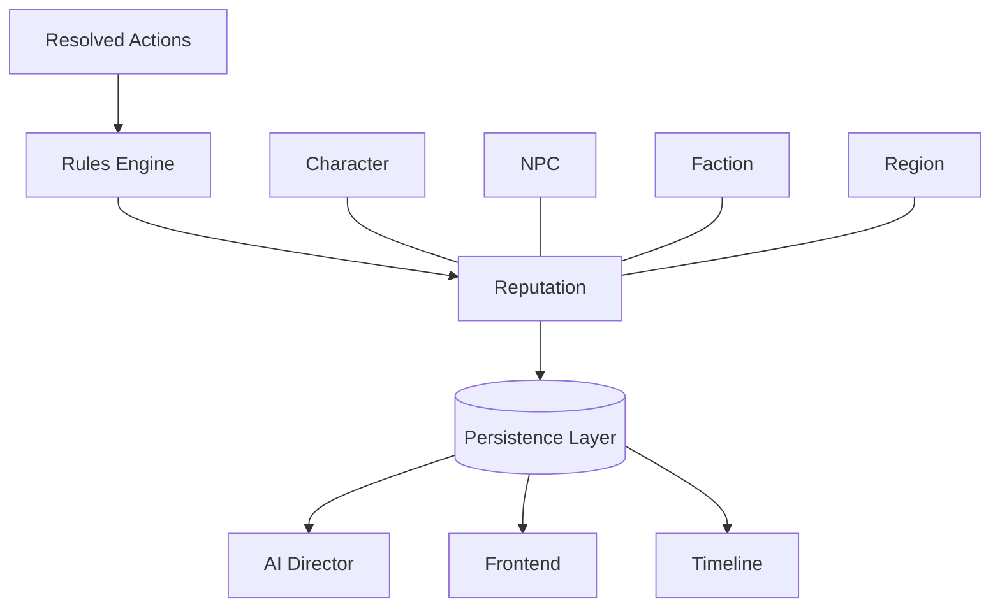

# Chronicle AI — Reputation

## Purpose

This document elaborates on the Reputation concept introduced in
[world-model.md](./world-model.md): how the Character is regarded by NPCs,
Factions, or Regions as a consequence of their actions within the Campaign.
It is implementation-agnostic and should be read alongside
[architecture-principles.md](./architecture-principles.md),
[character.md](./character.md), [npc.md](./npc.md),
[relationship.md](./relationship.md), [persistence.md](./persistence.md),
[rules-engine.md](./rules-engine.md), [ai-director.md](./ai-director.md),
[adventure-controller.md](./adventure-controller.md), and
[frontend.md](./frontend.md).

## What Reputation Represents

Reputation represents how an entity is regarded by the World at large — by
NPCs, Factions, or Regions who may never have interacted with that entity
directly, but have heard of them or witnessed the consequences of their
actions. Where a Relationship is the connection between two specific
entities, Reputation is broader and more diffuse: it is a standing that
precedes the Character or NPC into rooms they have never entered.

Reputation is an emergent property of resolved actions, not a value set
directly by any subsystem. It accumulates from what has actually happened in
the Campaign — the outcomes the Rules Engine has resolved and the
Persistence Layer has recorded — rather than from a single decision or a
single conversation.

This document does not define how Reputation is measured, scoped, or
categorized — that depends on the active ruleset and the Campaign it belongs
to. What matters architecturally is that Reputation is a durable fact about
the World, derived from history rather than declared outright.

## Reputation vs. Relationships

Reputation and Relationships are related but distinct concepts. A
Relationship is the state of connection between two specific entities — a
Character and one NPC, or one Faction and another. Reputation is how an
entity is regarded more broadly, by parties who may have no direct
Relationship with them at all.

A single resolved action can affect both at once: helping a village elder
might strengthen a Relationship with that NPC directly, while also shifting
the Character's Reputation with the Region the village belongs to. The two
concepts are tracked independently, even though they often move together.

## Authoritative Ownership

Reputation is a concept referenced by every subsystem, but it is not itself
an authority over any of the facts it represents:

- The **Rules Engine** is the sole authority for whether and how a resolved
  action changes Reputation, and for computing what that change is.
- The **Persistence Layer** is the sole authority for what an entity's
  Reputation currently is and has been — Reputation is only real once
  persisted.
- The **AI Director** describes Reputation narratively — how NPCs react,
  what rumors circulate, how a Region's mood shifts — but cannot create or
  modify Reputation on its own authority.
- The **Frontend** presents Reputation to the player, but holds no
  authoritative copy of it.
- The **Adventure Controller** ensures that any change to Reputation passes
  through the Rules Engine before it is persisted, and is persisted before
  it is narrated.

Reputation, in other words, is a shared reference point — not a source of
truth in itself. Its truth lives in the Persistence Layer; its changes are
decided by the Rules Engine; its expression belongs to the AI Director.

## Relationship to Other Concepts

Reputation is closely related to Relationships, but operates at the scale of
NPCs, Factions, and Regions rather than a single connection. It accumulates
through Quests and Encounters, shapes how NPCs and Factions initially treat
the Character or another NPC, and every change to it is recorded on the
Campaign's Timeline and made available to the player through the Journal and
Codex. See [world-model.md](./world-model.md) for how these concepts fit
together, and [character.md](./character.md) and [npc.md](./npc.md) for the
entities Reputation is held by.

## Reputation Evolution

Reputation evolves only through authoritative world events — actions
resolved by the Rules Engine and recorded by the Persistence Layer. It is
not set directly by narration, by the player, or by any single subsystem in
isolation; it emerges over time from the accumulated record of resolved
actions. Narration may describe the present state of a Character's or NPC's
Reputation, but it cannot independently create or adjust it.

## Architectural Invariants

- Reputation is persistent world state.
- Reputation is an emergent property of resolved actions, not a directly
  assigned value.
- AI narration cannot independently create or modify Reputation.
- Reputation changes become part of campaign history.
- Reputation survives across Sessions.
- Every subsystem uses the same authoritative Reputation.

## Mermaid Diagram

