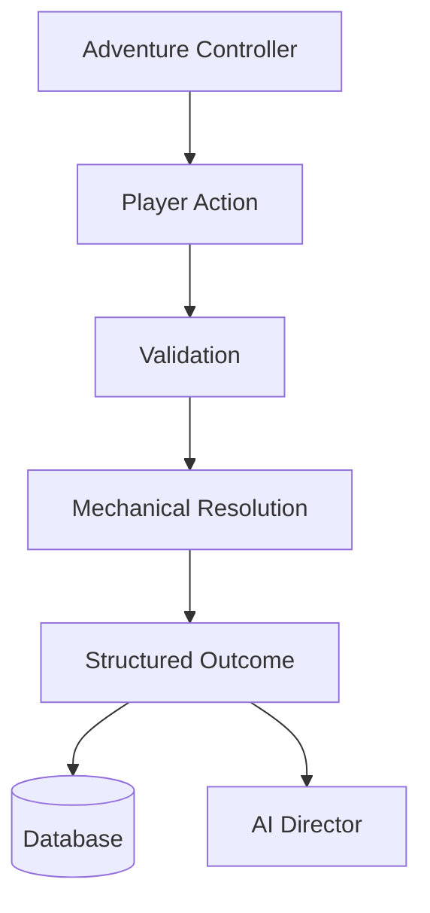

# Chronicle AI — Rules Engine

The Rules Engine is the deterministic gameplay authority in Chronicle AI. It
is the sole implementation of the "resolves" step in the platform's core
principle, defined in [system-overview.md](./system-overview.md):

> The model proposes. The rules engine resolves. The database remembers.

The Rules Engine exists to guarantee a strict, permanent separation between
deterministic mechanics and AI-generated narration. The AI Director may
describe events in any voice it chooses; it can never decide what those
events actually were. Only the Rules Engine decides that.

## Responsibilities

- Interpret a player's intended action in the context of current game state.
- Resolve dice rolls, modifiers, conditions, and combat.
- Determine success, failure, and any resulting effects on characters or the
  world.
- Produce a structured outcome that the AI Director can narrate and the
  database can persist.

## Inputs

The Rules Engine receives everything it needs to resolve an action
deterministically, and nothing more:

- Current world state.
- The player's action or intent.
- The active ruleset.
- Combat context, when applicable.
- Temporary modifiers and conditions in effect.
- A source of randomness (dice).

## Outputs

The Rules Engine produces structured, deterministic results, including:

- Success or failure.
- Dice results.
- Damage.
- Applied conditions.
- Resource changes.
- State changes.
- Combat effects.
- Event records suitable for persistence.

The Rules Engine never produces narrative prose, presentation formatting, or
storage records — only the structured outcome data described above.

## What the Rules Engine Owns

- All mechanical resolution: dice, modifiers, conditions, combat, and derived
  outcomes.
- The rules of whatever game system is currently active.
- Validation of whether an action is mechanically legal given current state.

## What the Rules Engine Does NOT Own

The Rules Engine never:

- Generates narrative prose.
- Controls pacing.
- Creates dialogue.
- Stores persistent data.
- Orchestrates subsystem execution.
- Renders UI.

These responsibilities belong to other architectural components: narrative
prose, pacing, and dialogue belong to the AI Director; persistent storage
belongs to the database; subsystem orchestration belongs to the Adventure
Controller; and presentation belongs to the frontend.

## Why the Rules Engine Is Deterministic

The Rules Engine must produce the same mechanical output given the same
inputs and state, every time. Determinism is what makes outcomes trustworthy
and auditable: a player can rely on the fact that success or failure was
decided by the rules of the game, not by the AI's discretion or mood. It also
frees the AI Director to narrate expressively — because it is describing an
outcome that has already been fixed, narration can never quietly rewrite what
happened.

## Action Flow

Actions reach the Rules Engine through the Adventure Controller, which is
responsible for invoking the engine at the correct point in the request flow.
The engine validates the action against current state, resolves it
mechanically, and emits a structured outcome. That outcome is handed onward
for persistence and for narration — the engine itself does neither.

## Mechanics vs. Narration

The Rules Engine and the AI Director operate on strictly separate concerns.
The engine decides *what happened*; the AI Director decides *how it's
described*. Narration is never permitted to alter, override, or invent a
mechanical outcome, and the engine never produces narrative prose. This
separation is what keeps outcomes fair and consistent regardless of how
evocative the narration is.

## Multiple Rule Systems

Chronicle AI is designed so that multiple tabletop systems can coexist
without changing the surrounding architecture. The Adventure Controller, AI
Director, and persistence layer are agnostic to which ruleset is active — the
active ruleset is simply one of the Rules Engine's inputs. Systems expected
to be supported over time include:

- D&D 5e
- Pathfinder
- Call of Cthulhu
- Shadowdark
- Homebrew systems

Adding a new system should not require changes outside the Rules Engine's own
boundary.

## Extensibility

Support for additional or custom rule systems is expected to be added through
an adapter or plugin model. Future rule systems must extend the architecture
described in this document rather than modify its core deterministic
contract — the responsibilities, inputs, outputs, and invariants defined here
apply to every ruleset the Rules Engine ever supports. No specific adapter or
plugin interface is defined here.

## Architectural Invariants

The following are permanent architectural constraints, not implementation
choices:

- Equal inputs always produce equal mechanical outputs.
- AI narration cannot modify mechanical outcomes.
- Every resolved action becomes part of persistent campaign history.
- Rules are evaluated before narration is generated.
- The Rules Engine is the sole authority for mechanics.
