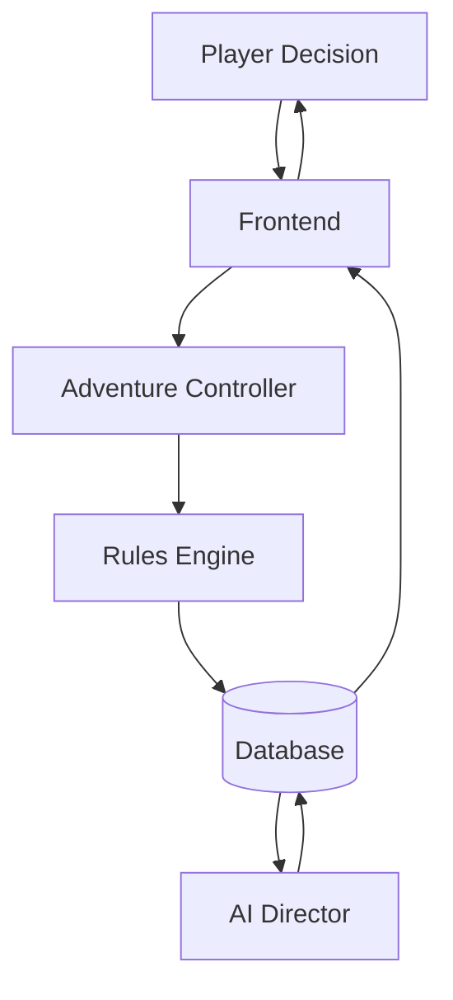

# Chronicle AI — System Overview

Chronicle AI is an AI-powered solo tabletop RPG platform. It combines
AI-generated narration with a deterministic rules engine and a persistent
database, so that no single subsystem is solely responsible for both
storytelling and outcomes.

## Core Principle

> The model proposes. The rules engine resolves. The database remembers.

- **The model proposes.** The AI (acting as a Game Director) suggests narrative
  framing, dialogue, and possible directions for the story. It never decides
  win/loss, damage, success/failure, or any other mechanical outcome.
- **The rules engine resolves.** All dice rolls, modifiers, conditions,
  combat, and action outcomes are computed deterministically by the rules
  engine, independent of what the AI narrates.
- **The database remembers.** Supabase is the single source of truth for
  persistent state — characters, campaigns, sessions, turns, and world state.
  Nothing that matters to gameplay lives only in memory or only in an AI
  response.

This separation exists so that narration can be rich and improvisational
without ever being allowed to fabricate or override game state.

## Major Subsystems

### Frontend (Player Interface)
Displays the current story state, campaign and character information, and
collects player decisions. It renders what the database and rules engine
report — it does not independently determine outcomes.

### Adventure Controller
Coordinates requests between the frontend, rules engine, AI Director, and
persistence layer.

It determines the order in which systems execute, ensuring deterministic
mechanics are resolved before narration is generated.

It contains orchestration logic but does not implement game rules itself.

### Rules Engine
The deterministic authority for gameplay. Given a player action and current
state, it resolves dice, modifiers, conditions, and combat, producing a
mechanical outcome. The rules engine's output is authoritative and cannot be
overridden by AI narration.

### AI Director / Narration Layer
Generates narrative prose and story direction based on the current world
state and the rules engine's resolved outcomes. It proposes how events are
described, but has no authority over whether those events actually happened
or what their mechanical effects are.

### Persistence Layer (Database)
Stores all durable game state: characters, campaigns, sessions, turn history,
and world state. It is the system of record — the frontend, rules engine, and
AI Director all read from and write to it rather than maintaining their own
independent truth.

## Request Flow

1. The player makes a decision in the frontend.
2. The frontend submits the action to the Adventure Controller.
3. The Adventure Controller routes the action to the rules engine, which
   resolves it and persists the outcome to the database.
4. The AI Director reads the updated state from the database and proposes
   narration, which is also persisted.
5. The frontend reads the resolved state and narration from the database and
   presents it back to the player.
