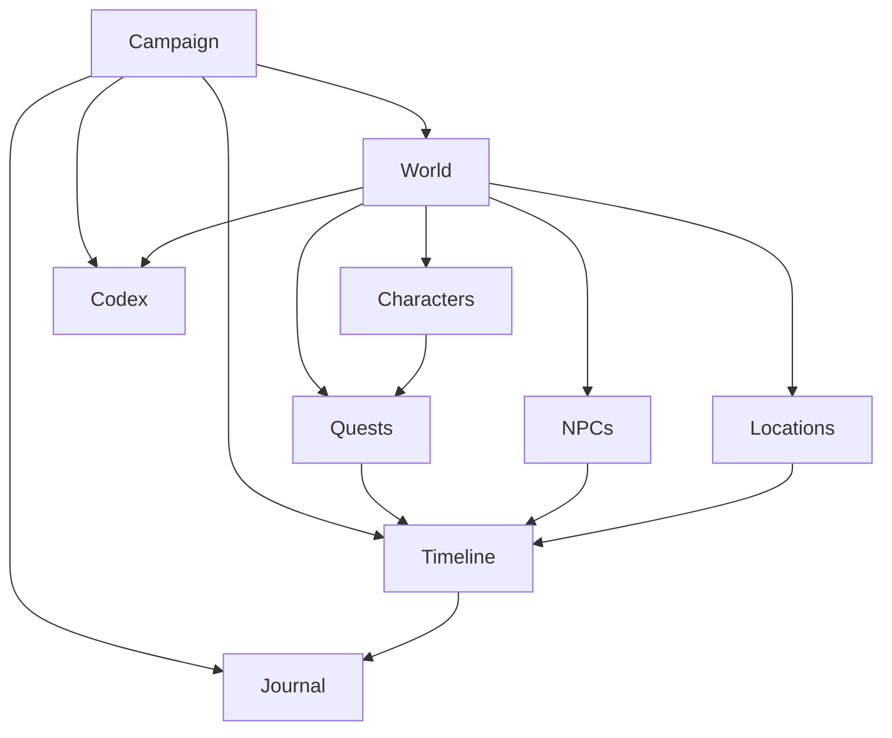

# Chronicle AI — World Model

## Purpose

This document defines Chronicle AI's conceptual world model: the vocabulary
of concepts that every subsystem uses to talk about a campaign. It is
implementation-agnostic — it defines what these concepts *mean*, not how they
are stored, transmitted, or coded. It should be read alongside
[architecture-principles.md](./architecture-principles.md),
[system-overview.md](./system-overview.md),
[rules-engine.md](./rules-engine.md), [persistence.md](./persistence.md), and
[ai-director.md](./ai-director.md).

## Concepts

**World** — The complete, persistent reality of a single campaign: every
character, location, faction, item, and fact that exists within it, at every
point in its history. The World is the totality that all other concepts
below are part of.

**Campaign** — A specific playthrough of a story within a World. A Campaign
is the container for everything a player has done and experienced — its
characters, its history, its current state.

**Session** — A bounded span of play within a Campaign, roughly analogous to
"sitting down to play." Sessions group Turns into a meaningful unit of
playtime without themselves changing what the World contains.

**Turn** — A single unit of play: a player's action, its resolution, and the
narration that describes it. Turns are the atomic steps by which a Campaign
advances.

**Character** — The player's persona within the World: their identity,
capabilities, possessions, and standing, as it evolves over the course of the
Campaign.

**NPC** — A non-player character: an inhabitant of the World with their own
identity, motivations, and continuity, who the Character can interact with.

**Location** — A specific place within the World where scenes occur — a
room, a building, a clearing, a dungeon.

**Region** — A broader area that groups related Locations, giving the World
geographic and cultural structure above the level of a single place.

**Faction** — An organized group within the World with its own goals,
alliances, and disposition toward the Character and other Factions.

**Item** — A discrete object that exists within the World and can be held,
used, found, or lost.

**Inventory** — The set of Items currently possessed by a Character or NPC.

**Quest** — A goal or thread of story that the Character is pursuing, with
its own state of progress within the Campaign.

**Encounter** — A bounded situation — often but not always combat — in which
the Character engages with NPCs, hazards, or circumstances that require
resolution.

**Journal** — A player-facing record of what has happened in the Campaign,
written in narrative terms.

**Codex** — A player-facing reference of what is known about the World's
people, places, factions, and lore.

**Timeline** — The ordered sequence of events that have occurred in the
Campaign, establishing what happened and in what order.

**Relationship** — The state of connection between the Character (or an NPC)
and another NPC or Faction — allies, rivals, family, and so on.

**Reputation** — How the Character is regarded by NPCs, Factions, or Regions
as a consequence of their actions within the Campaign.

## How These Concepts Relate

A **World** contains everything that can exist within a **Campaign** played
in it. A Campaign unfolds across **Sessions**, which are made up of
sequential **Turns**. Each Turn moves the **Timeline** forward by one event.

Within the World, **Characters** and **NPCs** occupy **Locations**, which are
grouped into **Regions**. Characters and NPCs hold **Items** in their
**Inventory**, belong to or interact with **Factions**, and hold
**Relationships** and **Reputation** with one another.

The Character pursues **Quests**, which advance through **Encounters**. What
happens along the way is recorded on the Timeline, summarized for the player
in the **Journal**, and referenced for lookup in the **Codex**.

None of these concepts exist independently of the World — a Quest, an NPC, or
a Faction only has meaning as part of the Campaign's World and its Timeline.

## Shared Vocabulary, Not Storage

The World Model is the shared vocabulary used by the Rules Engine,
Persistence Layer, AI Director, Adventure Controller, and Frontend. When the
Rules Engine resolves an Encounter, when the Persistence Layer records a
Quest's progress, when the AI Director narrates a Relationship, or when the
Frontend displays a Character's Inventory, all five subsystems are referring
to the same concepts, with the same meaning.

The World Model defines meaning, not storage. It says nothing about how a
Location or a Codex entry is represented, queried, or persisted — that is an
implementation concern for the Persistence Layer. The World Model exists so
that every subsystem agrees on what a "Faction" or a "Turn" *is*, independent
of how any one of them happens to represent it internally.

## Architectural Invariants

- The world is reconstructed from persisted state.
- Narration may describe the world but cannot create authoritative world
  facts by itself.
- Mechanical changes must pass through authoritative systems before becoming
  world state.
- World state must remain consistent across subsystems.

## Relationships Diagram

